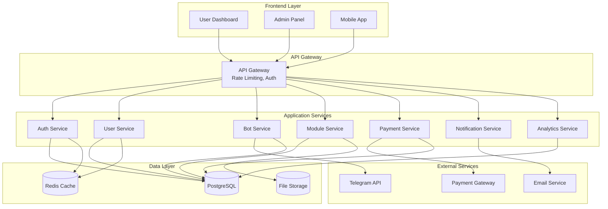
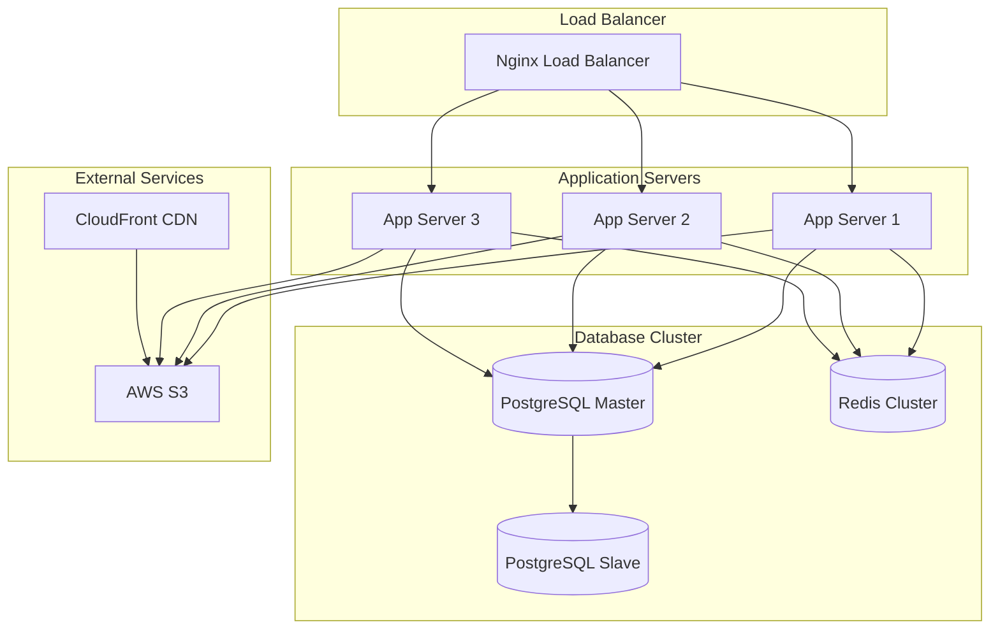

# Design Document

## Overview

Платформа TeleBotics представляет собой многоуровневую веб-систему для управления модулями заработка в Telegram ботах. Архитектура построена на принципах микросервисов с четким разделением ответственности между компонентами.

Система состоит из трех основных интерфейсов:
- **Пользовательская панель** - для владельцев ботов
- **Административная панель** - для управления платформой  
- **API для разработчиков** - для интеграции модулей

## Architecture

### High-Level Architecture



### Technology Stack

**Frontend:**
- React.js с TypeScript для пользовательского интерфейса
- Next.js для SSR и оптимизации
- Tailwind CSS для стилизации с поддержкой темной/светлой темы
- Chart.js для аналитических графиков
- Socket.io для real-time уведомлений

**Backend:**
- Node.js с Express.js для API сервисов
- TypeScript для типизации
- JWT для аутентификации
- Passport.js для OAuth интеграций

**Database:**
- PostgreSQL как основная база данных
- Redis для кэширования и сессий
- AWS S3 для хранения файлов модулей

**Infrastructure:**
- Docker для контейнеризации
- Nginx как reverse proxy
- PM2 для управления процессами Node.js

## Components and Interfaces

### 1. Authentication Service

**Responsibilities:**
- Регистрация и авторизация пользователей
- Управление JWT токенами
- Email верификация
- Восстановление паролей
- Управление ролями (user, admin, developer)

**Key APIs:**
```typescript
POST /auth/register
POST /auth/login
POST /auth/verify-email
POST /auth/forgot-password
POST /auth/refresh-token
```

### 2. User Service

**Responsibilities:**
- Управление профилями пользователей
- Настройки аккаунта
- Партнерская программа
- Управление балансом

**Key APIs:**
```typescript
GET /users/profile
PUT /users/profile
GET /users/balance
GET /users/referrals
POST /users/referral-link
```

### 3. Bot Service

**Responsibilities:**
- Подключение Telegram ботов
- Валидация токенов через Telegram API
- Получение информации о ботах
- Управление статусом ботов

**Key APIs:**
```typescript
POST /bots/connect
GET /bots/list
PUT /bots/:id/settings
DELETE /bots/:id
GET /bots/:id/stats
```

**Telegram Integration:**
```typescript
// Валидация бота
async validateBotToken(token: string) {
  const response = await fetch(`https://api.telegram.org/bot${token}/getMe`);
  return response.json();
}
```

### 4. Module Service

**Responsibilities:**
- Каталог модулей заработка
- Активация/деактивация модулей
- Настройка наценки
- Управление API ключами
- Модерация модулей

**Key APIs:**
```typescript
GET /modules/catalog
POST /modules/:id/activate
PUT /modules/:id/settings
GET /modules/:id/api-keys
POST /modules/upload (для разработчиков)
```

**Module Configuration:**
```typescript
interface ModuleConfig {
  id: string;
  name: string;
  description: string;
  category: string;
  price: number;
  markup_percentage: number;
  api_endpoints: string[];
  webhook_url: string;
}
```

### 5. Payment Service

**Responsibilities:**
- Обработка платежей за модули
- Управление балансом пользователей
- Комиссии и выплаты
- Партнерские начисления
- История транзакций

**Key APIs:**
```typescript
POST /payments/create
GET /payments/history
POST /payments/withdraw
GET /payments/balance
POST /payments/webhook
```

### 6. Notification Service

**Responsibilities:**
- Email уведомления
- Push уведомления в браузере
- Системные уведомления
- Рассылки пользователям

**Key APIs:**
```typescript
POST /notifications/send
GET /notifications/list
PUT /notifications/:id/read
POST /broadcasts/create
```

### 7. Analytics Service

**Responsibilities:**
- Сбор статистики по ботам
- Аналитика доходов
- Метрики использования модулей
- Отчеты для администраторов

**Key APIs:**
```typescript
GET /analytics/revenue
GET /analytics/bot-stats
GET /analytics/module-usage
GET /analytics/admin-dashboard
```

## Data Models

### User Model
```typescript
interface User {
  id: string;
  email: string;
  password_hash: string;
  first_name: string;
  last_name: string;
  role: 'user' | 'admin' | 'developer';
  balance: number;
  referral_code: string;
  referred_by: string | null;
  email_verified: boolean;
  theme_preference: 'light' | 'dark' | 'system';
  created_at: Date;
  updated_at: Date;
}
```

### Bot Model
```typescript
interface Bot {
  id: string;
  user_id: string;
  telegram_bot_id: string;
  name: string;
  username: string;
  description: string;
  token_hash: string; // Зашифрованный токен
  status: 'active' | 'inactive' | 'suspended';
  webhook_url: string;
  created_at: Date;
  updated_at: Date;
}
```

### Module Model
```typescript
interface Module {
  id: string;
  name: string;
  description: string;
  category: string;
  price: number;
  developer_id: string;
  status: 'pending' | 'approved' | 'rejected' | 'suspended';
  code_url: string; // S3 URL
  documentation_url: string;
  api_endpoints: string[];
  webhook_required: boolean;
  created_at: Date;
  updated_at: Date;
}
```

### Bot Module Activation
```typescript
interface BotModuleActivation {
  id: string;
  bot_id: string;
  module_id: string;
  markup_percentage: number;
  api_key: string;
  status: 'active' | 'inactive';
  settings: Record<string, any>;
  activated_at: Date;
  expires_at: Date | null;
}
```

### Transaction Model
```typescript
interface Transaction {
  id: string;
  user_id: string;
  type: 'payment' | 'withdrawal' | 'commission' | 'refund';
  amount: number;
  currency: 'USD' | 'RUB';
  status: 'pending' | 'completed' | 'failed' | 'cancelled';
  description: string;
  metadata: Record<string, any>;
  created_at: Date;
  processed_at: Date | null;
}
```

## Error Handling

### Error Response Format
```typescript
interface ErrorResponse {
  error: {
    code: string;
    message: string;
    details?: any;
    timestamp: string;
  };
}
```

### Common Error Codes
- `AUTH_REQUIRED` - Требуется авторизация
- `INVALID_TOKEN` - Недействительный токен
- `BOT_NOT_FOUND` - Бот не найден
- `MODULE_NOT_AVAILABLE` - Модуль недоступен
- `INSUFFICIENT_BALANCE` - Недостаточно средств
- `RATE_LIMIT_EXCEEDED` - Превышен лимит запросов

### Error Handling Strategy
1. **Validation Errors** - Возвращаются с кодом 400 и детальным описанием
2. **Authentication Errors** - Код 401 с перенаправлением на страницу входа
3. **Authorization Errors** - Код 403 с объяснением недостатка прав
4. **Not Found Errors** - Код 404 с предложением альтернатив
5. **Server Errors** - Код 500 с логированием для администраторов

## Testing Strategy

### Unit Testing
- Jest для тестирования бизнес-логики
- Покрытие минимум 80% для критических компонентов
- Моки для внешних API (Telegram, платежные системы)

### Integration Testing
- Тестирование API endpoints
- Проверка взаимодействия с базой данных
- Тестирование webhook'ов

### End-to-End Testing
- Cypress для тестирования пользовательских сценариев
- Автоматизированное тестирование критических путей
- Тестирование на разных устройствах и браузерах

### Performance Testing
- Load testing с помощью Artillery
- Мониторинг времени отклика API
- Тестирование под нагрузкой для Telegram webhook'ов

## Security Considerations

### Authentication & Authorization
- JWT токены с коротким временем жизни (15 минут)
- Refresh токены для продления сессий
- Rate limiting для предотвращения брутфорса
- RBAC (Role-Based Access Control) для разграничения доступа

### Data Protection
- Шифрование токенов ботов в базе данных
- HTTPS для всех соединений
- Валидация и санитизация всех входных данных
- SQL injection защита через параметризованные запросы

### API Security
- API ключи для доступа к модулям
- Webhook signature verification
- CORS настройки для фронтенда
- Request/Response логирование для аудита

### Infrastructure Security
- Регулярные обновления зависимостей
- Мониторинг уязвимостей
- Backup стратегия для данных
- Изоляция сервисов через Docker

## Deployment Architecture

### Production Environment


### Monitoring & Logging
- **Application Monitoring**: New Relic или DataDog
- **Log Aggregation**: ELK Stack (Elasticsearch, Logstash, Kibana)
- **Error Tracking**: Sentry для отслеживания ошибок
- **Uptime Monitoring**: Pingdom для мониторинга доступности

### CI/CD Pipeline
1. **Code Commit** → GitHub/GitLab
2. **Automated Testing** → Jest, Cypress
3. **Code Quality Check** → ESLint, SonarQube
4. **Build & Package** → Docker images
5. **Deploy to Staging** → Автоматическое развертывание
6. **Manual Approval** → Для production
7. **Deploy to Production** → Blue-green deployment

## Scalability Considerations

### Horizontal Scaling
- Stateless application servers для легкого масштабирования
- Load balancing между несколькими инстансами
- Database read replicas для распределения нагрузки чтения

### Caching Strategy
- Redis для кэширования часто запрашиваемых данных
- CDN для статических ресурсов
- Application-level кэширование для API responses

### Database Optimization
- Индексы для часто используемых запросов
- Партиционирование больших таблиц (transactions, analytics)
- Connection pooling для оптимизации подключений

### Performance Optimization
- Lazy loading для больших списков
- Pagination для API endpoints
- Image optimization и compression
- Minification и bundling для frontend ресурсов